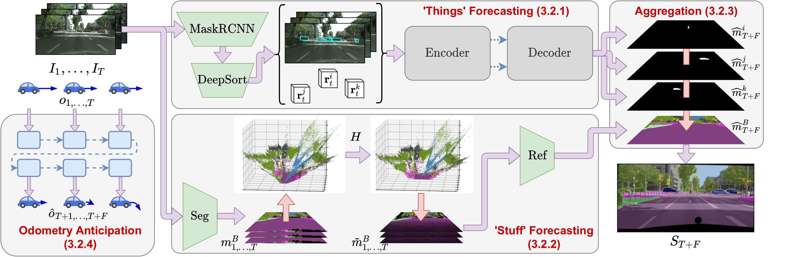

# [Panoptic Segmentation Forecasting](https://arxiv.org/abs/2104.03962)
**Colin Graber, Grace Tsai, Michael Firman, Gabriel Brostow, Alexander Schwing - CVPR 2021**

\[[Link to paper](https://arxiv.org/abs/2104.03962)\]


We propose to study the novel task of ‘panoptic segmentation forecasting’: given a set of observed frames, the goal is to forecast the panoptic segmentation for a set of unobserved frames. We also propose a first approach to forecasting future panoptic segmentations. In contrast to typical semantic forecasting, we model the motion of individual object instances and the background separately. This makes instance information persistent during forecasting, and allows us to understand the motion of each moving object.



## ⚙️ Setup

### Dependencies
- Python 3.7
- PyTorch 1.5.1
- pyyaml
- pandas
- h5py
- opencv
- tensorboard
- tqdm
- [pytorch_scatter 2.0.5](https://github.com/rusty1s/pytorch_scatter)
- [cityscapesscripts](https://github.com/mcordts/cityscapesScripts) (for evaluation)
- [Google Cloud SDK](https://cloud.google.com/sdk/docs/install) (for downloading data/models)

Install the code using the following command:
`pip install -e ./`

### Data
- To run this code, the `gtFine_trainvaltest` dataset will need to be downloaded from the [Cityscapes website](https://www.cityscapes-dataset.com/) into the `data/` directory.
- The remainder of the required data can be downloaded using the script `download_data.sh`. By default, everything is downloaded into the `data/` directory. 
- Training the background model requires generating a version of the semantic segmentation annotations where foreground regions have been removed. This can be done by running the script `scripts/preprocessing/remove_fg_from_gt.sh`.
- Training the foreground model requires additionally downloading a pretrained MaskRCNN model. This can be found at [this link](https://dl.fbaipublicfiles.com/detectron2/Cityscapes/mask_rcnn_R_50_FPN/142423278/model_final_af9cf5.pkl). This should be saved as `pretrained_models/fg/mask_rcnn_pretrain.pkl`.
- Training the background model requires additionally downloading a pretrained HarDNet model. This can be found at [this link](https://ping-chao.com/hardnet/hardnet70_cityscapes_model.pkl). This should be saved as `pretrained_models/bg/hardnet70_cityscapes_model.pkl`.

## Running our code
The `scripts` directory contains scripts which can be used to train and evaluate the foreground, background, and egomotion models. Specifically:
- `scripts/odom/run_odom_train.sh` trains the egomotion prediction model.
- `scripts/odom/export_odom.sh` exports the odometry predictions, which can then be used during evaluation by other models
- `scripts/bg/run_bg_train.sh` trains the background prediction model.
- `scripts/bg/run_export_bg_val.sh` exports predictions make by the background using input reprojected point clouds which come from using predicted egomotion.
- `scripts/fg/run_fg_train.sh` trains the foreground prediction model.
- `scripts/fg/run_fg_eval_panoptic.sh` produces final panoptic semgnetation predictions based on the trained foreground model and exported background predictions. This also uses predicted egomotion as input.

We provide our pretrained foreground, background, and egomotion prediction models. The data downloading script additionally downloads these models into the directory `pretrained_models/`

## ✏️ 📄 Citation

If you found our work relevant to yours, please consider citing our paper:
```
@inproceedings{graber-2021-panopticforecasting,
 title   = {Panoptic Segmentation Forecasting},
 author  = {Colin Graber and
            Grace Tsai and
            Michael Firman and
            Gabriel Brostow and
            Alexander Schwing},
 booktitle = {Computer Vision and Pattern Recognition ({CVPR})},
 year = {2021}
}
```

# 👩‍⚖️ License
Copyright © Niantic, Inc. 2021. Patent Pending. All rights reserved. Please see the license file for terms.
